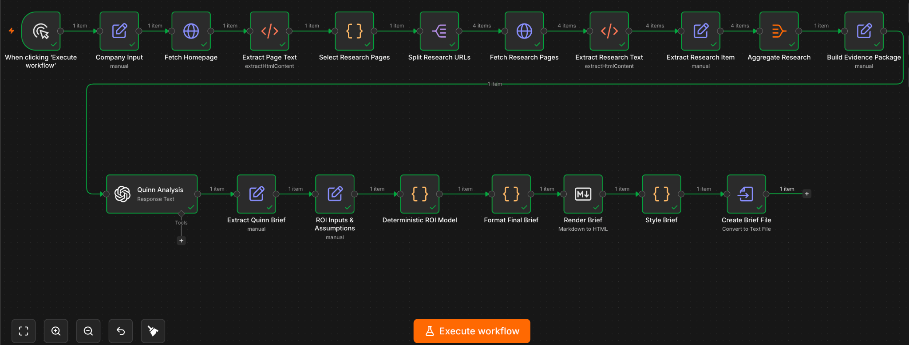

# Enterprise Meeting Prep + ROI Workflow

An AI-enabled n8n workflow for researching a prospective frontline company, preparing an evidence-grounded enterprise meeting brief, and building a deterministic ROI case once customer-specific inputs are available.

> **Independent portfolio project.** I built this as part of my application for Quinn's Founder’s Associate, Strategy & Special Projects role. It is not affiliated with or endorsed by Quinn or Hiller Plumbing, Heating, Cooling & Electrical. Hiller is used only as an illustrative prospect based on publicly available information.

## Demo

**[View the live Hiller meeting brief →](https://anc002.github.io/enterprise-meeting-prep-roi/)**

The example shows the pre-meeting state of the workflow: public-company research, evidence-grounded hypotheses, discovery questions, and the customer inputs required before a defensible ROI can be calculated.

## Why I built this

Quinn's role description called out work such as preparing for enterprise sales meetings, building ROI models, writing research reports, and turning customer conversations into a point of view.

Rather than only saying I would be interested in that work, I wanted to explore what my approach could look like in practice.

The workflow is built around a simple principle:

**AI handles ambiguity; math handles money.**

The LLM is used where interpretation is useful: synthesizing public evidence, separating facts from hypotheses, identifying unknowns, and developing discovery questions.

The business-case math is handled separately with deterministic JavaScript so missing values are never invented, assumptions remain explicit, and the LLM never calculates ROI.

## Workflow



The workflow has two main stages.

### 1. Pre-meeting intelligence

Inputs:

- company name
- website
- meeting context

The workflow then:

1. Fetches the company homepage.
2. Extracts page text and links.
3. Scores and selects a small set of high-value research pages across four evidence categories:
   - workforce / careers
   - company / about
   - operating footprint
   - news / growth
4. Fetches and cleans those pages.
5. Aggregates the evidence into a structured package.
6. Sends only that supplied evidence to the OpenAI analysis step.
7. Produces:
   - company snapshot
   - frontline operating evidence with source URLs
   - relevance hypotheses
   - source conflicts
   - important unknowns
   - seven discovery questions
   - ROI inputs to collect
   - meeting POV

### 2. Post-discovery ROI

Once real customer inputs are available, they can be entered into the `ROI Inputs & Assumptions` node.

The deterministic model can calculate:

- manager hours saved per hire
- annual manager hours saved
- annual manager-time value
- ramp weeks saved per hire
- annual workforce-weeks gained
- annual quality / rework savings
- quantified annual benefit
- net annual benefit
- ROI %
- payback period

Ramp-time improvement is kept as an operational metric unless there is a defensible way to monetize it.

If required inputs are missing, the workflow outputs **Customer input required** instead of treating missing values as zero.

## Key design decisions

### Evidence before inference

The analysis step is explicitly instructed to separate:

- **Facts** — directly supported by supplied public evidence
- **Hypotheses** — plausible implications that still need validation
- **Unknowns** — information not established by the evidence

Facts retain source URLs so the underlying evidence can be inspected directly.

### Internal vs. customer-facing evidence

One failure mode I found during testing was confusing what a company sells with how its own employees operate.

For example, a company may sell training to customers without using that same training internally.

The workflow therefore distinguishes customer-facing products, services, or training from internal workforce processes. A customer-facing offering cannot be used as evidence of an internal employee-training process unless the supplied evidence explicitly supports that connection.

### Source conflicts are preserved

When two public pages report different figures, the workflow does not silently reconcile them.

Instead, it surfaces the discrepancy and, when possible, notes which source appears newer while preserving both reported values.

### Deterministic ROI

The LLM never calculates ROI.

The ROI model:

- uses only supplied numeric inputs
- validates percentages and target-ramp assumptions
- does not convert missing values to zero
- separates quantified financial levers from unquantified ones
- keeps scenario assumptions explicit

## Example: Hiller

The included example uses Hiller Plumbing, Heating, Cooling & Electrical as an illustrative prospect.

The workflow surfaced public evidence including:

- 520+ technicians
- a multi-state operating footprint
- Total Tech, Hiller's internal trade school and hands-on training facility
- ongoing expansion and acquired-team integration
- public emphasis on technical expertise and customer care

From that evidence, the workflow generated hypotheses around:

- post-training reinforcement
- field readiness
- manager knowledge transfer
- customer-facing roleplay
- post-acquisition standardization

It did **not** assume that Hiller has a training problem. The brief keeps that as something to validate through discovery.

**[View the live Hiller meeting brief →](https://anc002.github.io/enterprise-meeting-prep-roi/)**

## Robustness testing

I tested the workflow across different frontline operating models:

- **Hiller** — field services / skilled trades
- **Cintas** — distributed B2B route operations
- **Chipotle** — restaurant / hourly frontline operations

Testing exposed two important failure modes that changed the design:

1. A keyword-based page selector could mistake customer-facing training pages for internal workforce evidence.
2. Some websites use anti-bot / CDN protections that block direct HTTP retrieval.

The first issue led to evidence-category scoring and explicit internal-vs-customer-facing guardrails.

For the second, V1 intentionally surfaces the retrieval failure rather than attempting to bypass site protections.

## Tech stack

- **n8n** — workflow orchestration
- **HTTP Request + HTML nodes** — public webpage retrieval and extraction
- **JavaScript Code nodes** — deterministic URL selection, validation, ROI calculations, and formatting
- **OpenAI via n8n** — evidence-grounded synthesis
- **Markdown + HTML** — readable final meeting brief

## Running the workflow

1. Import `workflow.json` into n8n.
2. Connect your own OpenAI credential to the `Quinn Analysis` node.
3. Update the `Company Input` node with:
   - `company_name`
   - `website`
   - `meeting_context`
4. Leave ROI inputs blank for a pre-meeting brief.
5. Execute the workflow.
6. Open the generated HTML file from `Create Brief File`.

After discovery, enter customer-specific values in `ROI Inputs & Assumptions` and rerun the downstream ROI/output steps to generate the quantified business-case section.

## Current limitations

This is a focused V1, not a production research agent.

- Research is limited to pages discoverable from the supplied company website.
- Sites with anti-bot protections may block direct retrieval.
- The page-selection logic is heuristic rather than a general web-search system.
- ROI inputs are entered manually in n8n rather than through a customer-facing form.
- Human review is still appropriate before using a brief in a live sales meeting.
- The workflow represents my proposed approach, not Quinn's internal sales process.

## Potential V2

- account and persona enrichment through a GTM data provider such as Clay
- broader browser/search-based research
- a small agentic research loop for evidence gaps
- direct Google Docs / CRM export
- a lightweight form for ROI inputs
- automated evaluation against a larger set of frontline companies

## Repository structure

```text
.
├── README.md
├── workflow.json
├── index.html
└── examples/
    ├── workflow-overview.png
    └── hiller-meeting-brief.html
